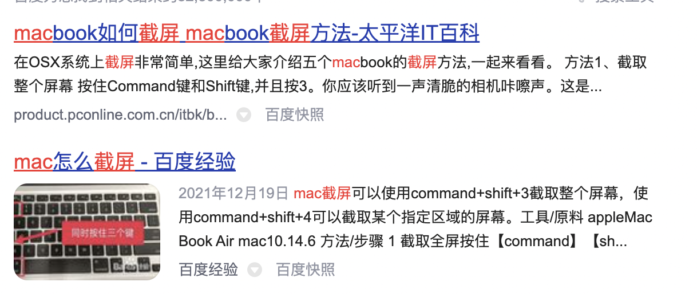
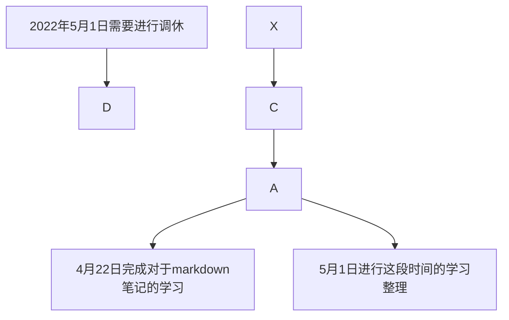
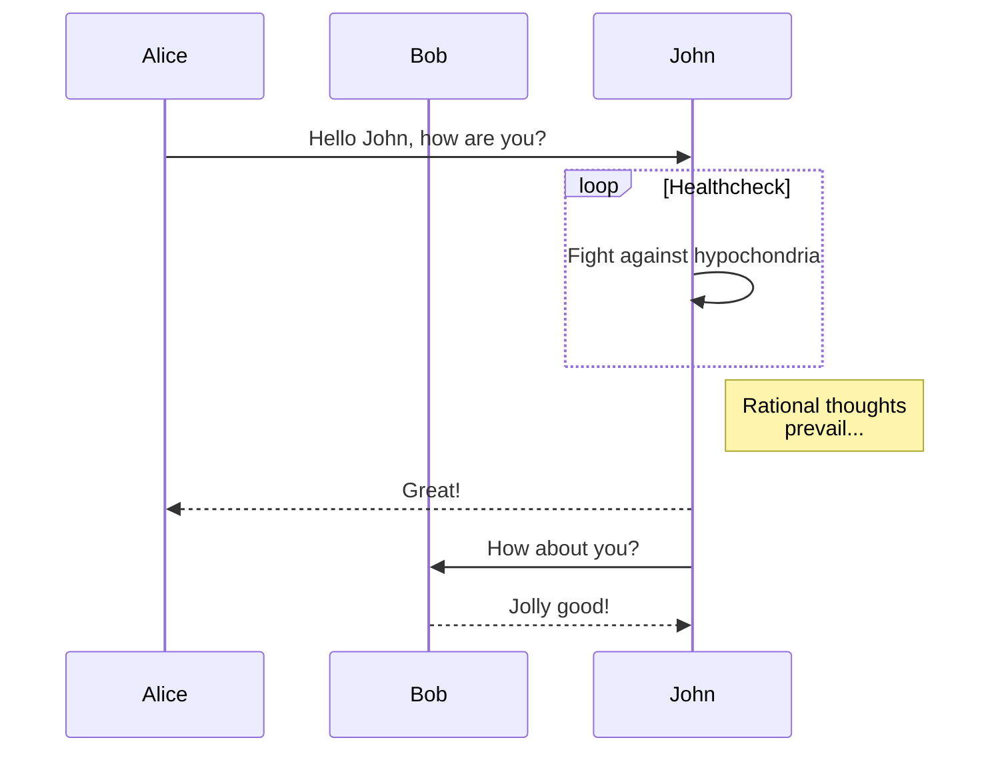
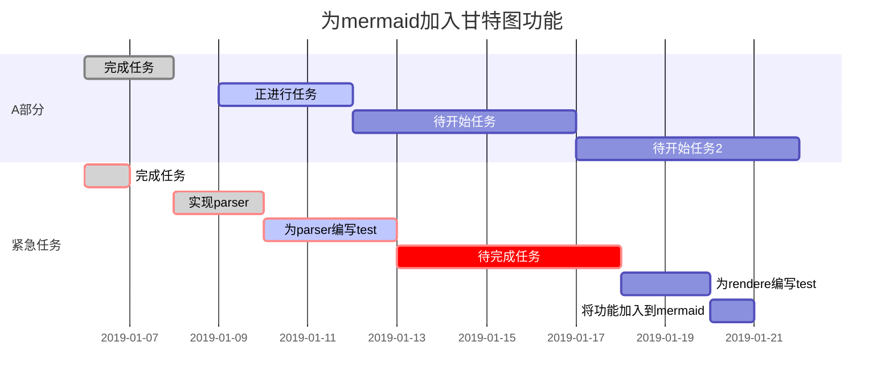

#一级标题
##二级标题
###三级标题
正文直接在文本中输入就可以了：
那么今天是2022年4月22日
```python
print(
    'hello world'
    )
```
如果加上指定语言名称，就会根据语言进行程序高亮显示

```cpp
std::cout << hello world << std::endl;
```
正文中的代码 `show ip reference `


有序列表 正常用数字+点符号即可
1.123
2.456
3.789


无序列表
- 123
  - 123
    - 123

**加粗用两个星号表示** 

*如果是斜体就用一个星号表示*

~~如果是删除线，那么就用两个波浪线~~


|   a   | b      | c      |
| :---: | :----- | :----- |
| 居中  | 左对齐 | 左对齐 |

表格的制作就是用｜符号来表示隔断，然后用：和--结合来表示居中对齐方式


图片插入按照下面这个格式，中括号[]中是对该图片的称呼，小括号()中是图片位置


插入链接
[百度一下](https://www.baidu.com)


画流程图


时序图



甘特图


